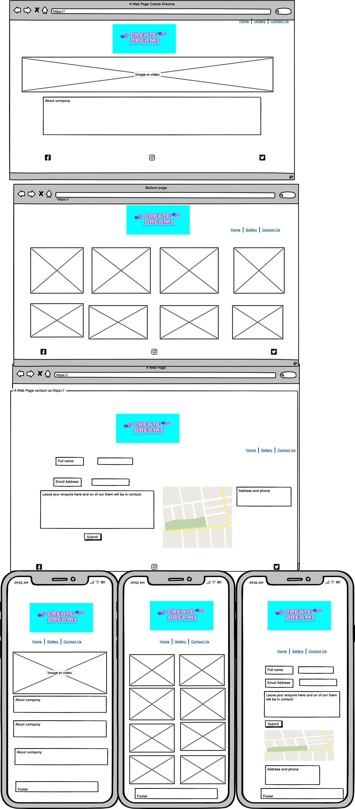

Create Dreams is a website for a balloon decorations and party hire business. So potential customers can veiw the decorations the business can create and the items they have available to hire.
---
# CONTENTS

* [GOAL](#Goal)
* [USER STORIES](#User)
* [FEATURES](#Features)
* [HOME PAGE](#Home)
* [GALLERY PAGE](#Gallery)
* [CONTACT PAGE](#Contact)
* [RESPONSE PAGE](#Response)
* [TECHNOLOGIES USED](#Technologies)
* [DESIGN](#Design)
* [WIREFRAME](#Wireframe)
* [TESTING](#Testing)
* [BUGS](#Bugs)
* [DEPLOYMENT](#Deployment)
* [CREDITS](#Credits)

---
# Goal

* To display completed projects.

* To be informative to visitors.

* To show the user of the type work the company does and
 make it easy for user to contact and make enquiries.

# User Storie

### As Visitor

* As a user I want to be able to navigate the site easy.

* As a user I want to be able to find some images of pass project.

* As a user I want to be able to find contact information.

* As a user I want to be able to submit an enquirery.

* As a user I want to be able to find contact information.

### As Business Owner

* As the business owner i want potential customers to be able to navigate site easily.

* As a business owner i want potenial customer to be able to send us and enquiry.

* As a business owner i want to be able to display our work in a gallery.

---

# Features

## Navbar

  ####  Links

   * HOME - takes the users Main page where users can find out information on the business.

   * Gallery - takes the users to a gallery of images of the business recent work.
   
   * Contact Us - takes the users to the contact form page where a form can be filled out so they can contact the business.

   ### Navigation is responsive

   * On large screens the logo floats left and the navigation bar float to right inline.

   

   * On small screens the navigation bar float under the logo to center of screen.

   

## Footer

* The footer is fixed to the bottom of the page.
* It contains links to the companies facebook,Instagram,twitter and tiktok pages.
* The links change color when hoverd over.

 # Home Page

 ## *Introduction to Company*

  * Welcomes Visitor to site.
  * Breif introduction to Business.
  * Informs visitors of the products the business has to offer.
  * Invites visitors to view gallery page.
  * A Background Image of a bunch of pastel ballons is display behind the text which complements the color palette.  

  

 # Gallery Page

  * Has a background color.
  * Each image has a color border.
  * Each image has a figcaption.
  * It has upto date images of recent work completed by the company.

  

  # Contact page

   *Contact page includes a contact form*

   * It has Input field for Name which is required to be filled out.
   * It has Input field for Email address which is required to be fill out.
   * It has a message box to be fill out to send enquiries.
   * it has a submit botton that leads to a response page.

   
   

   # Response page

   * Visitors are directed to response page after submitting contact form.
   * It displays a thank you message and informs the user that they will be contacted soon.
   * It then directs the user to the Home page. 

   ---

   # Technologies Used
   - [HTML](https://developer.mozilla.org/en-US/docs/Web/HTML) 
   - [CSS](https://developer.mozilla.org/en-US/docs/Web/css)
   - [CSS Flexbox](https://developer.mozilla.org/en-US/docs/Learn/CSS/CSS_layout/Flexbox) 
   - [CSS Grid](https://developer.mozilla.org/en-US/docs/Web/CSS/grid)
   - [Balsamiq](https://balsamiq.com/)
   - [GitHub](https://github.com/) 
   - [Codeanywhere](https://codeanywhere.com/)
   - [Canva](https://www.canva.com/)

---

# Design

## Logo

* Logo was created using Canva.
* The design was choosen as identifies the business.
* Colors where aligns with the business image. 
* Logo when click leads back to home page.

## Color Pallette

 
 
 ## Fonts
 
 * Fuzzy bubbles was the main font used on the website as it work well with font in the logo. 

 

 *  Sriracha was use on the navigation menu as it balanced well with font used in main body and logo.

 

# Wireframe

- 

# Testing

* I have tested the site  on Chorme, Safari anf firefox
* I have tested the site on different screen sizes to confirm it is responsive.
* I have tested all link to confirm they are functioning.

# Bugs

# Deployment

* GitHub pages was used to deploy the site.
* This was done by: 
* Firstly go to [GitHub repository](https://edelcorbett.github.io/CREATE-DREAMS/),
* Then go to the Settings 
* From the source section drop-down menu, select the **Main** Branch, then click "Save".
* The page will be automatically refreshed with a detailed ribbon display to indicate the successful deployment.

LIVE LINK  [CREATE DREAMS](https://edelcorbett.github.io/CREATE-DREAMS/)

# Credits 

## Images
* background image was use from Pexels.
* All Images in gallery were provided by Create Dreams.