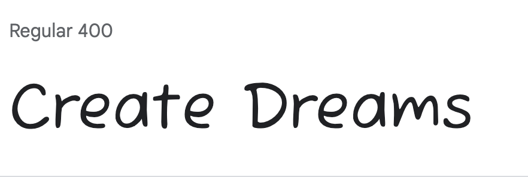

Create Dreams is a website for a balloon decorations and party hire business. So that potential customers can veiw the decorations the business can create and the items they have available to hire.
---

---
# CONTENTS

* [GOAL](#Goal)
* [USER STORIES](#User)
* [FEATURES](#Features)
* [HOME PAGE](#Home)
* [GALLERY PAGE](#Gallery)
* [CONTACT PAGE](#Contact)
* [RESPONSE PAGE](#Response)
* [TECHNOLOGIES USED](#Technologies)
* [DESIGN](#Design)
* [WIREFRAME](#Wireframe)
* [TESTING](#Testing)
* [BUGS](#Bugs)
* [DEPLOYMENT](#Deployment)
* [CREDITS](#Credits)

---
# Goal

* To display completed projects.

* To be informative to visitors.

* To show the user of the type work the company does and
 make it easy for user to contact and make enquiries.

# User Storie

### As Visitor

* As a user I want to be able to navigate the site easy.

* As a user I want to be able to find some images of pass project.

* As a user I want to be able to find contact information.

* As a user I want to be able to submit an enquirery.

* As a user I want to be able to find contact information.

### As Business Owner

* As the business owner i want potential customers to be able to navigate site easily.

* As a business owner i want potenial customer to be able to send us and enquiry.

* As a business owner i want to be able to display our work in a gallery.

---

# Features

## Navbar

  ####  Links

   * HOME - takes the users Main page where users can find out information on the business.

   * Gallery - takes the users to a gallery of images of the business recent work.
   
   * Contact Us - takes the users to the contact form page where a form can be filled out so they can contact the business.

   ### Navigation is responsive

   * On large screens the logo floats left and the navigation bar float to right inline.

   

   * On small screens the navigation bar float under the logo to center of screen.

   

## Footer

* The footer is fixed to the bottom of the page.
* It contains links to the companies facebook,Instagram,twitter and tiktok pages.
* The links change color when hoverd over.

# Home Page

 ## *Introduction to Company*

  * Welcomes Visitor to site.
  * Breif introduction to Business.
  * Informs visitors of the products the business has to offer.
  * Invites visitors to view gallery page.
  * A Background Image of a bunch of pastel ballons is display behind the text which complements the color palette.  

  

 # Gallery Page

  * Has a background color.
  * Each image has a color border.
  * Each image has a figcaption.
  * It has upto date images of recent work completed by the company.

  

  # Contact page

   *Contact page includes a contact form*

   * It has Input field for Name which is required to be filled out.
   * It has Input field for Email address which is required to be fill out.
   * It has a message box to be fill out to send enquiries.
   * it has a submit botton that leads to a response page.

   *Contact page includes a Map*
   * The Map indicates the area which the business supplies. 

   
   
  # Response page

   * Visitors are directed to response page after submitting contact form.
   * It displays a thank you message and informs the user that they will be contacted soon.
   * It then directs the user to the Home page. 

   ---

   # Technologies Used
   - [HTML](https://developer.mozilla.org/en-US/docs/Web/HTML) 
   - [CSS](https://developer.mozilla.org/en-US/docs/Web/css)
   - [CSS Flexbox](https://developer.mozilla.org/en-US/docs/Learn/CSS/CSS_layout/Flexbox) 
   - [CSS Grid](https://developer.mozilla.org/en-US/docs/Web/CSS/grid)
   - [Balsamiq](https://balsamiq.com/)
   - [GitHub](https://github.com/) 
   - [Codeanywhere](https://codeanywhere.com/)
   - [Canva](https://www.canva.com/)

---

# Design

## Logo

* Logo was created using Canva.
* The design was choosen as identifies the business.
* Colors where aligns with the business image. 
* Logo when click leads back to home page.

## Color Pallette

 
 
 ## Fonts
 
 * Fuzzy bubbles was the main font used on the website as it work well with font in the logo. 

 

 *  Sriracha was use on the navigation menu as it balanced well with font used in main body and logo.

 

---
# [Wireframes](documentation/create-dream.png)
* Wireframes were created in Balsamiq 
* It includes a desktop and a mobile  wireframe.

---
# Testing

* I have tested the site  on Chorme, Safari and firefox
* I have tested the site on different screen sizes to confirm it is responsive.
* I have tested all link to confirm they are functioning.
---
## Validator Testing
### [W3C](https://validator.w3.org/) was used for validation of Html
* [Home page html](documentation/w3cindex.html.png) 
* [Gallery page html](documentation/w3cgallery.html.png)
* [Contact page html](documentation/w3ccontact.html.png)
 * [Response page html](documentation/w3cresponse.html.png) 

 ### [Jigsaw](https://jigsaw.w3.org/css-validator/) was used for validation of CSS
---
## Lighthouse Testing

### DESKTOP
* [Home page](documentation/light-testing/lh-hp-desktop.png)
* [Gallery page](documentation/light-testing/lh-gp-desktop.png)
* [Contact page](documentation/light-testing/lh-cp-desktop.png)
* [Response page](documentation/light-testing/lh-rp-desktop.png)

### MOBILE

* [Home Page](documentation/light-testing/lh-hp-mobile.png)
* [Gallery Page](documentation/light-testing/lh-gp-mobile.png)
* [Contact Page](documentation/light-testing/lh-cp-mobile.png)
* [Response Page](documentation/light-testing/lh-rp-mobile.png)
---
# Manual Testing
| Feature | Expect | Action | Result |Tested |
|---|---|---|---|---|
| Header ||||
| Logo | When clicked return to home page. | Click logo on header | Return to home page when clicked.| Pass|
| Navbar Home Button| When clicked return to home page. | Click Home button in header |  Home page opened when clicked. | Pass |
| Navbar Gallery Button| When clicked opens to gallery page. | Click gallery button in header | Gallery page opened | Pass |
| Navbar Contact Button | When clicked open contact  page. | Click contact button in header | Contact  page opened when clicked.| Pass |
| Form Submit Button | When clicked contact form is submited and a response page is opened.  | Click Submit Button|Contact form is submited. | Pass |
| Form name input | Name required | Enter Name | Name required to be able to submit form .| Pass |
| Form Email input| Email Required | Enter Email address | Email address required to be able to submit form. | Pass |
| Responsen Page| Displays after submit button is clicked and redirects to home page after 10 seconds | Click Submit button | Returns to home page when after 10 seconds.| Pass |
| Social media Icons | When clicked opens conecting website in new tab . | Click icon in footer | opened new tab to the relevant site. | Pass |

# Bugs

* There is an Error still showing but this  error is due to google map used on the contact page, i have test on multiple devices and every thing work as it should. 

# Deployment

* GitHub pages was used to deploy the site.
* This was done by: 
  1. Sign in to GitHub account
  2. Go to [GitHub repository](https://edelcorbett.github.io/CREATE-DREAMS/),
  3. Go to the **Settings** 
  4. Click **Pages** on the navgation on the left hand side .
  5. In the source section select the **Main** Branch
  6. Select the root folder
  6. Then click "Save".
* The site is deployed and is accessable by the URL at top of page

LIVE LINK  [CREATE DREAMS](https://edelcorbett.github.io/CREATE-DREAMS/)

# Credits 

* [CSS TRICKS](https://css-tricks.com/)
* Kevin Powell youtube channel for css tutorials.
* [Coolors](https://coolors.co/) was used to create color palette.
* [Canva](https://www.canva.com/) was used to create logo.
* [Pexels](https://www.pexels.com/) was used for background image.
* [Flexbox forggy](https://flexboxfroggy.com/) to learn flexbox.
* [Stack overflow](https://stackoverflow.com/) for information.
* [W3Schools](https://www.w3schools.com/) was used as reference
* [Techsini](http://techsini.com/) was used for resposive mock-up 

## Images
* Background image was use from Pexels.
* All Images in gallery were provided by Create Dreams.

## Acknowledgements
*